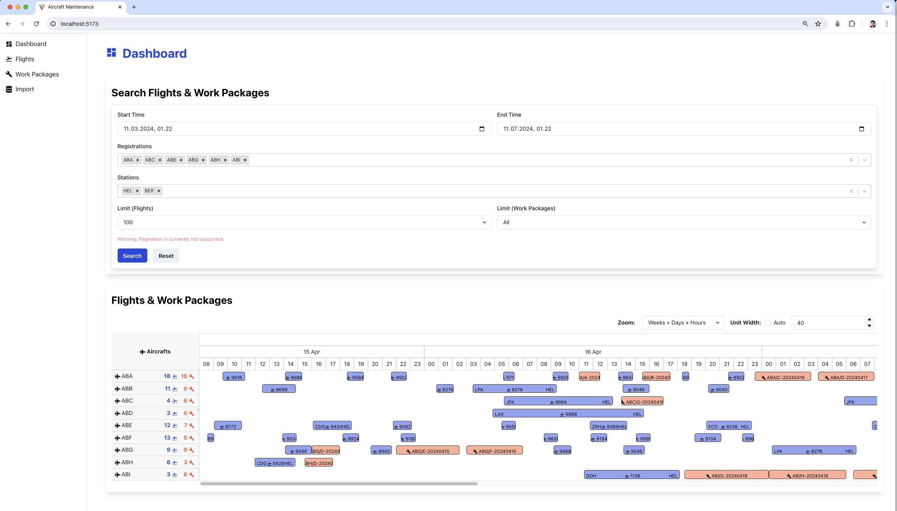
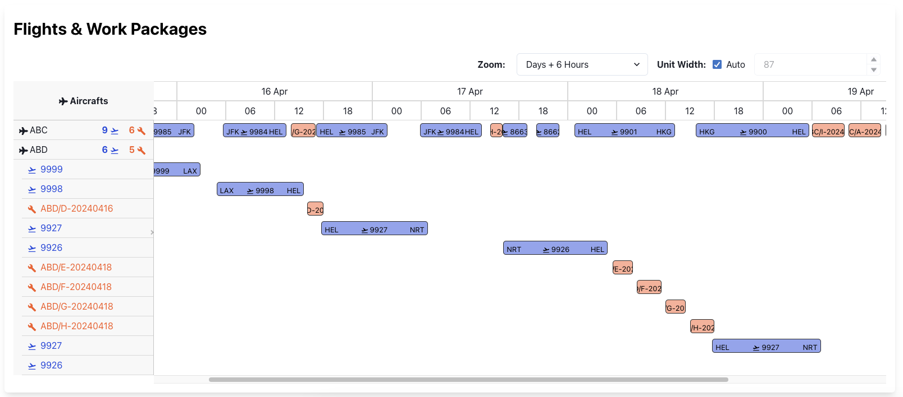

# Aircraft Maintenance

This proof-of-concept project provides the backend and frontend services for visualizing aircraft flights and maintenance work packages in a timeline component. The backend is built with NestJS, TypeORM, and TypeScript, the frontend is built with Vite, React, and TypeScript, and the data is stored in a PostgreSQL database. The services are containerized using Docker and can be easily set up using Docker Compose.

This project was assigned to me as a job-seeking challenge. This document descibes the details on how to install and use the web application, how I solved this challenge from different aspects.

## Content

1. [**Installation instructions**](docs/installation.md)
2. [**User instructions**](docs/usage.md)
3. [**Requirement analysis and assumptions**](docs/requirements.md)
4. [**Software design, implementation and testing**](docs/requirements.md) 

## Snapshots

1. The dashboard page:
   

2. The Gantt-chart-like timeline:

3. The time ruler format options:

# License
This project is licensed under the MIT License.