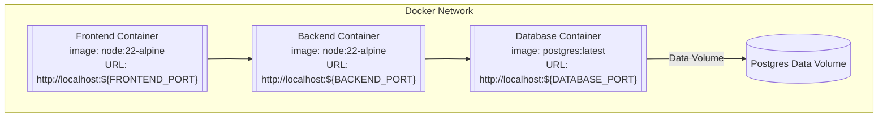

# Deployment and Testing

## Dockerization

## Dockerization

The backend, frontend, and database components are dockerized to ensure consistency across different environments and to simplify the deployment process. The following files are used for dockerization:

| Component | File                                                | Description                                                                     |
| --------- | --------------------------------------------------- | ------------------------------------------------------------------------------- |
| All       | [docker-compose.yml](../docker-compose.yml)         | Defines services for backend, frontend, and database.                           |
| All       | [.env](../.env.example)                             | Example environment variables for Docker services.                              |
| Backend   | [backend/Dockerfile](../backend/Dockerfile)         | Dockerfile for building the backend service.                                    |
|           | [backend/.dockerignore](../backend/.dockerignore)   | Specifies files and directories to ignore in the backend Docker build context.  |
| Frontend  | [frontend/Dockerfile](../frontend/Dockerfile)       | Dockerfile for building the frontend service.                                   |
|           | [frontend/.dockerignore](../frontend/.dockerignore) | Specifies files and directories to ignore in the frontend Docker build context. |

The figure below shows how the containers interact with each other:

The `.env` file (see the [example file](../.env.example)) allows setting environment settings for each container, such as database credentials, ports, and log levels.

## Testing

### Unit Test

All test suites were executed successfully. The unit tests cover all the critical paths of the application and utilize mocking techniques to isolate and test individual components effectively. Below is the coverate unit test report of the backend.

| File                                    | % Stmts | % Branch | % Funcs | % Lines | Uncovered Line #s  |
| --------------------------------------- | ------- | -------- | ------- | ------- | ------------------ |
| All files                               | 73.94   | 65.95    | 74.13   | 74.11   |                    |
| src                                     | 0       | 0        | 0       | 0       |                    |
| app.module.ts                           | 0       | 0        | 100     | 0       | 1-19               |
| main.ts                                 | 0       | 0        | 0       | 0       | 1-74               |
| src/aircraft-task                       | 100     | 100      | 100     | 100     |                    |
| aircraft-task.entity.ts                 | 100     | 100      | 100     | 100     |                    |
| src/config                              | 0       | 0        | 0       | 0       |                    |
| data-source.config.ts                   | 0       | 100      | 100     | 0       | 2-6                |
| data-source.ts                          | 0       | 100      | 0       | 0       | 1-11               |
| typeorm.config.ts                       | 0       | 0        | 0       | 0       | 2-61               |
| src/flight                              | 88.37   | 78       | 84.61   | 88.83   |                    |
| flight-filter.dto.ts                    | 100     | 100      | 100     | 100     |                    |
| flight-import.dto.ts                    | 100     | 100      | 100     | 100     |                    |
| flight.controller.ts                    | 100     | 100      | 100     | 100     |                    |
| flight.entity.ts                        | 91.66   | 0        | 0       | 90.9    | 155-163            |
| flight.module.ts                        | 0       | 100      | 100     | 0       | 1-12               |
| flight.service.ts                       | 82.35   | 85.29    | 84.61   | 81.7    | ...47-152, 161-190 |
| src/migration                           | 0       | 100      | 0       | 0       |                    |
| 1719696725304-CreateFlightsView.ts      | 0       | 100      | 0       | 0       | 3-18               |
| ...ddIndexesToFlightsAndWorkPackages.ts | 0       | 100      | 0       | 0       | 3-23               |
| src/work-package                        | 90.64   | 85.18    | 100     | 91.35   |                    |
| work-package-filter.dto.ts              | 100     | 100      | 100     | 100     |                    |
| work-package-import.dto.ts              | 100     | 100      | 100     | 100     |                    |
| work-package.controller.ts              | 100     | 100      | 100     | 100     |                    |
| work-package.entity.ts                  | 100     | 100      | 100     | 100     |                    |
| work-package.module.ts                  | 0       | 100      | 100     | 0       | 1-12               |
| work-package.service.ts                 | 88.88   | 84       | 100     | 88.4    | ...37-149, 158-163 |

### Test Summary

- **Test Suites:** 4 passed, 4 total
- **Tests:** 44 passed, 44 total
- **Snapshots:** 0 total
- **Time:** 6.652 s

All test suites were executed successfully.
