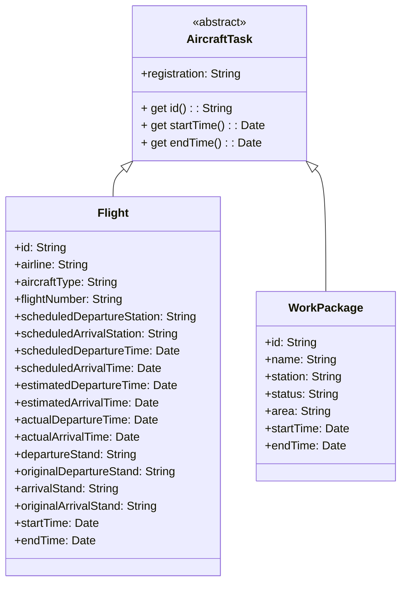
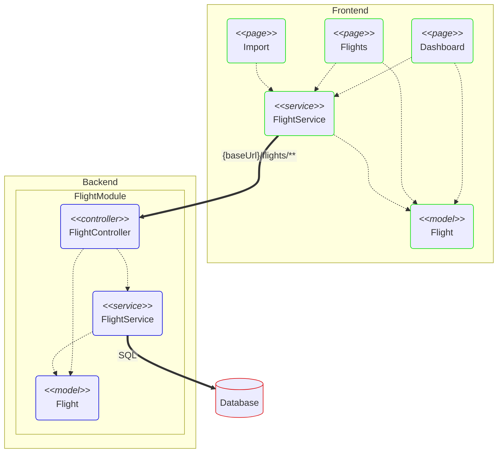

# Software Design and Implementation

In this section, I describe the chosen technologies and the rationale behind these choices, detailing how they contribute to the overall solution.

## Technology Stack

### Database

I chose PostgreSQL for data persistence because it provides better debugging features compared to in-memory databases. Additionally, it allows me to demonstrate my capability of using Dockerized databases.

### Backend

In addition to the required `Node.js` and `TypeScript` for the backend, I selected:

- `Nest.js` - a progressive Node.js framework for building efficient, reliable, and scalable server-side applications. Compared to other frameworks like `Express.js` and `Koa`, Nest.js offers a more structured and opinionated approach, which helps in maintaining consistency and improving developer productivity. Its modular architecture and built-in support for TypeScript make it an excellent choice for enterprise-level applications. Additionally, `TypeORM` is well-integrated with `Nest.js`, ensuring seamless database interactions and reducing the boilerplate code needed for setup.
- `TypeORM` - an ORM that supports both Active Record and Data Mapper patterns, making it flexible and powerful for handling database operations.
- `yarn` - a package manager that doubles down as project manager, offering advantages like faster dependency installation and better security checks compared to `npm`.

### Frontend

In addition to the required `React.js` and `TypeScript`, I chose:

- `Vite` - a fast build tool and development server that offers significant performance improvements over traditional tools like `Webpack` and `Create React App`. Vite's instant server start and lightning-fast hot module replacement enhance the development experience, making it a preferred choice for modern web development. Compared to `Next.js`, which is a comprehensive React framework offering server-side rendering, static site generation, and API routes, Vite focuses purely on the development build tool and dev server aspects, providing a lighter and faster development environment for projects that do not require `Next.js`'s full suite of features.
- `ChakraUI` (`@chakra-ui/react`, `@emotion/react`) - a modular and accessible component library that simplifies the creation of responsive and themeable interfaces, offering a more streamlined experience compared to libraries like `Material-UI`.
- `SASS` - a CSS preprocessor for styling that allows for more advanced features such as variables, nested rules, and mixins, enhancing the maintainability and scalability of the stylesheet compared to plain CSS.
- `axios` - a promise-based HTTP client for making requests, offering a cleaner and more intuitive API than the native `fetch` function.
- `chakra-react-select` - a select component built for Chakra UI, providing a consistent look and feel with the rest of the UI components.
- `moment` and `date-fns` - libraries for date manipulation and formatting, chosen for their comprehensive functionality and ease of use.
- `pino` and `pino-pretty` - logging libraries for enhanced log management, offering better performance and flexibility compared to `winston`.
- `react-icons` - a library of popular icons for React, ensuring a wide selection of icons that can be easily integrated into the project.
- `react-resizable` - a library for making components resizable, adding interactive flexibility to the UI.
- `react-router-dom` - a library for routing and navigation, known for its simplicity and ease of integration with React applications.
- `@floating-ui/react-dom` - a library for creating floating elements, such as tooltips and dropdowns, with excellent positioning capabilities.
- `yarn`

## Data Model

As mentioned in [**Requirement analysis and assumptions**](requirements.md), the data model was designed as simple as possible to address the current requirements without anticipating other needs.

In this project, I used the Code-First approach for ORM design, leveraging TypeORM features. This means the database schema is generated from the entity classes defined in the code, ensuring consistency and reducing discrepancies between the code and the database. This approach also facilitates easier maintenance and refactoring through migrations.

### Class Diagram

Two classes, `Flight` and `WorkPackage`, inherit from a common abstract class `AircraftTask` so that they can be easily added to `AircraftTask` arrays.

### Database Schema

The following database schema is automatically generated with support of `TypeORM` migration feature.

#### **Table "aircraft_maintenance/flights"**

| Column                      | Type                     | Collation | Nullable | Default            |
| --------------------------- | ------------------------ | --------- | -------- | ------------------ |
| registration                | character varying        |           | not null |                    |
| id                          | uuid                     |           | not null | uuid_generate_v4() |
| airline                     | character varying        |           | not null |                    |
| aircraftType                | character varying        |           | not null |                    |
| flightNumber                | character varying        |           | not null |                    |
| scheduled_departure_station | character varying        |           | not null |                    |
| scheduled_arrival_station   | character varying        |           | not null |                    |
| scheduled_departure_time    | timestamp with time zone |           | not null |                    |
| scheduled_arrival_time      | timestamp with time zone |           | not null |                    |
| estimated_departure_time    | timestamp with time zone |           |          |                    |
| estimated_arrival_time      | timestamp with time zone |           |          |                    |
| actual_departure_time       | timestamp with time zone |           |          |                    |
| actual_arrival_time         | timestamp with time zone |           |          |                    |
| departure_stand             | character varying        |           |          |                    |
| original_departure_stand    | character varying        |           |          |                    |
| arrival_stand               | character varying        |           |          |                    |
| original_arrival_stand      | character varying        |           |          |                    |

Indexes:

- **PK_c614ef3382fdd70b6d6c2c8d8dd**: PRIMARY KEY, btree (id)
- **IDX_90f8ce97196559b19a5107a8e6**: btree (airline, registration, "aircraftType", "flightNumber", scheduled_departure_station, scheduled_arrival_station)

#### **Table "public.work_packages"**

| Column       | Type                     | Collation | Nullable | Default |
| ------------ | ------------------------ | --------- | -------- | ------- |
| registration | character varying        |           | not null |         |
| id           | character varying        |           | not null |         |
| name         | character varying        |           | not null |         |
| station      | character varying        |           | not null |         |
| status       | character varying        |           | not null |         |
| area         | character varying        |           | not null |         |
| start_time   | timestamp with time zone |           | not null |         |
| end_time     | timestamp with time zone |           | not null |         |

Indexes:

- **PK_7ee5049471d751ff51d8e71720f**: PRIMARY KEY, btree (id)
- **IDX_43016ba59df8359d36e436c3a9**: btree (registration, station, status, area)

## Software Architecture

Both frontend and backend use OOP and `MVC` (Model-View-Controller) patterns. In both layers, &lt;&lt;models&gt;&gt; are traditional `M` (Models), &lt;&lt;services&gt;&gt; play the role of the traditional `C` (Controllers). Frontend &lt;&lt;pages&gt;&gt; and backend &lt;&lt;controllers&gt;&gt; are the traditional `V` (Views). See a design fragment related to flights in the picture below.

### RESTful API

API documentation for the aircraft maintenance services

### Flights

| Method | Endpoint                       | Description                                 |
| ------ | ------------------------------ | ------------------------------------------- |
| POST   | /flights                       | Create a new flight                         |
| GET    | /flights                       | Get all flights                             |
| GET    | /flights/{id}                  | Get a flight by ID                          |
| PUT    | /flights/{id}                  | Update a flight by ID                       |
| DELETE | /flights/{id}                  | Delete a flight by ID                       |
| POST   | /flights/search                | Search flights with optional filters        |
| POST   | /flights/import                | Import flights from JSON                    |
| GET    | /flights/categories/{category} | Get unique and sorted values for a category |

### Work Packages

| Method | Endpoint                             | Description                                 |
| ------ | ------------------------------------ | ------------------------------------------- |
| POST   | /work-packages                       | Create a new work package                   |
| GET    | /work-packages                       | Get all work packages                       |
| GET    | /work-packages/{id}                  | Get a work package by ID                    |
| PUT    | /work-packages/{id}                  | Update a work package by ID                 |
| DELETE | /work-packages/{id}                  | Delete a work package by ID                 |
| POST   | /work-packages/search                | Search work packages with optional filters  |
| POST   | /work-packages/import                | Import work packages from JSON              |
| GET    | /work-packages/categories/{category} | Get unique and sorted values for a category |

## Module Structure

### Backend

The backend modules `FlightModule` and `WorkPackageModule` are organized according to the popular module structure in NestJS projects. This approach promotes modularity and separation of concerns, making the codebase more maintainable and scalable. Each module encapsulates related components, ensuring a clear and organized architecture.

The file structure of the backend is available [here](./backend_structure.txt).

### Frontend

As required in the [Requirements](./requirements.md), the common components and utilities, not specific to the aircraft domain, are separated into modules `common` and `ganttCharts`, so that they can be easily reused in other applications.

The file structure of the frontend is available [here](./frontend_structure.txt).
