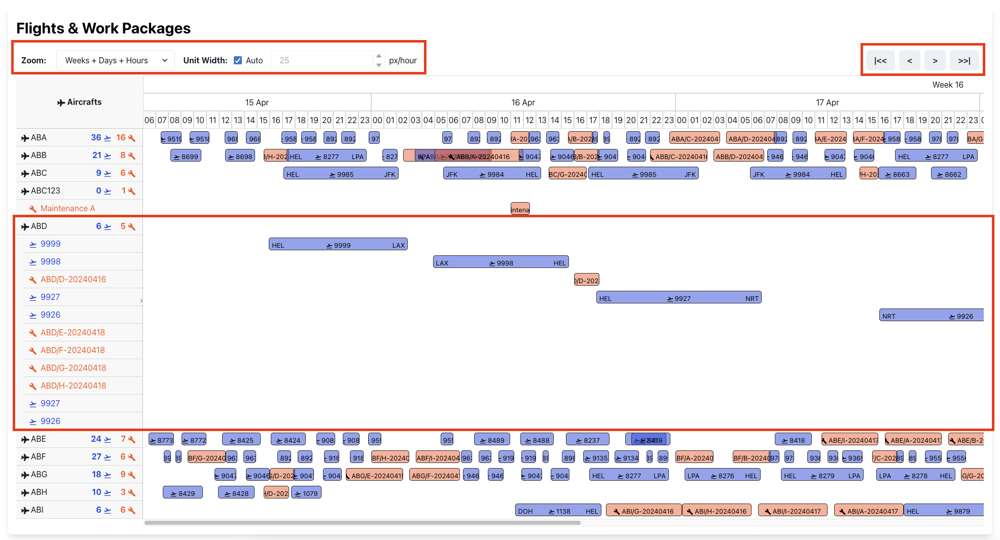

## User Instructions

### 1. Page `Import`


Open tab `Import` in the left sidebar. Choose tab **Flight** or **Work Packages** depending on what you want to import, then choose a JSON file and click button `Import`.


The JSON files should have the same formats as sample files included in the assignment (see below). Note that the application only validates the data types, but does not validate their values.


- File [flights.json](sample-data/flights.json):
    ```json
    [
        {
            "flightId": "b9ee236a-7e95-4bfd-a5ec-29b1220b898f",
            "airline": "QO",
            "registration": "ABA",
            "aircraftType": "AT7",
            "flightNum": "8923",
            "schedDepTime": "2024-04-16T16:55:00.000Z",
            "schedArrTime": "2024-04-16T18:05:00.000Z",
            "actualDepTime": "2024-04-16T17:08:00.000Z",
            "actualArrTime": "2024-04-16T18:14:00.000Z",
            "estimatedDepTime": "2024-04-16T17:05:00.000Z",
            "estimatedArrTime": "2024-04-16T18:14:00.000Z",
            "schedDepStation": "HEL",
            "schedArrStation": "RIX",
            "depStand": "A2",
            "origDepStand": "A4"
        }
    ]

- File [work-packages.json](sample-data/work-packages.json)
    ```json
    [
        {
            "workPackageId": "19392169122587",
            "name": "ABA/A-20240416",
            "station": "HEL",
            "status": "OPEN",
            "area": "APRON",
            "registration": "ABA",
            "startDateTime": "2024-04-16T08:00:00.000Z",
            "endDateTime": "2024-04-16T09:30:00.000Z"
        }
    ]

    ```

In case of wrong file format, you will see thi error message:


### Page `Dashboard`:

   
Open tab `Dashboard` in the left sidebar, specify criteria for filtering **Flights** and **Work Packages** such as:

*  `Start Time` and `End Time`: start and end time of **Flights** and **Work Packages**. In case of **Flights**, the `Start Time` is defined as the actual departure time (if any), or the estimated departure time (if any) or the scheduled departure time. Similarly, the `End Time` is defined as the arrival departure time (if any), or the estimated arrival time (if any), or the scheduled arrival time.

* `Registrations` are the aircraft registration numbers.
* `Stations` are the airports related to the **Flights** or **Work Packages**. In case of **Flights**, the `Stations` can be either the departure stations, or the arrival stations.

* `Limits` are the maximum numbers of **Flights** and **Work Packages** to be displayed in the timeline.

Click button `Search` to see the results in the `Timeline`. 


In the `Timeline` controller, user can:
* See the numbers of **Flights** and **Work Packages** of each **Aircraft** grouped together in one row.
* Collapse and expand **Aircraft** task groups to see more details, like in Gantt Chart.
* See names, departure and arrival stations **Flights** and **Work Packages**. The station names are automatically hidden if the task bar is too narrow.
* See tooltips with full details of **Flights** **Work Packages** in JSON formats.




Most importantly, user can:
* Zoom in and zoom out the time ruler.
* Set unit width `Auto` or change it manually.
* Select various time ruler options:
  * Days + Hours
  * Days + 3 Hours
  * Days + 6 Hours
  * Weeks + Days
  * Weeks + Days + Hours
  * Weeks + Days + 3 Hours
  * Weeks + Days + 6 Hours
  * Months + Days + 3 Hours
  * Months + Weeks + Days


### Page `Flights`:

This is an additional page. 
Open tab `Flights` in the left sidebar, specify criteria for filtering **Flights** such as `Start Time`/`End Time`, `Flight Numbers`, `Airlines`, `Registrations`, `Aircraft Types`, `Departure Stations`, `Arrival Stations`, and `Limit`.

The found **Flights** will be displayed in a table format. Paging and sorting features are currently unsupported.


### Page `Work Packages`:

This is another additional page. 
Open tab `Work Packages` in the left sidebar, specify criteria for filtering **Work Packages** such as `Start Time`/`End Time`, `Registrations`, `Stations`, `Statuses`, `Areas`, and `Limit`.

The found **Work Packages** will be displayed in a table format. Paging and sorting features are currently unsupported.


